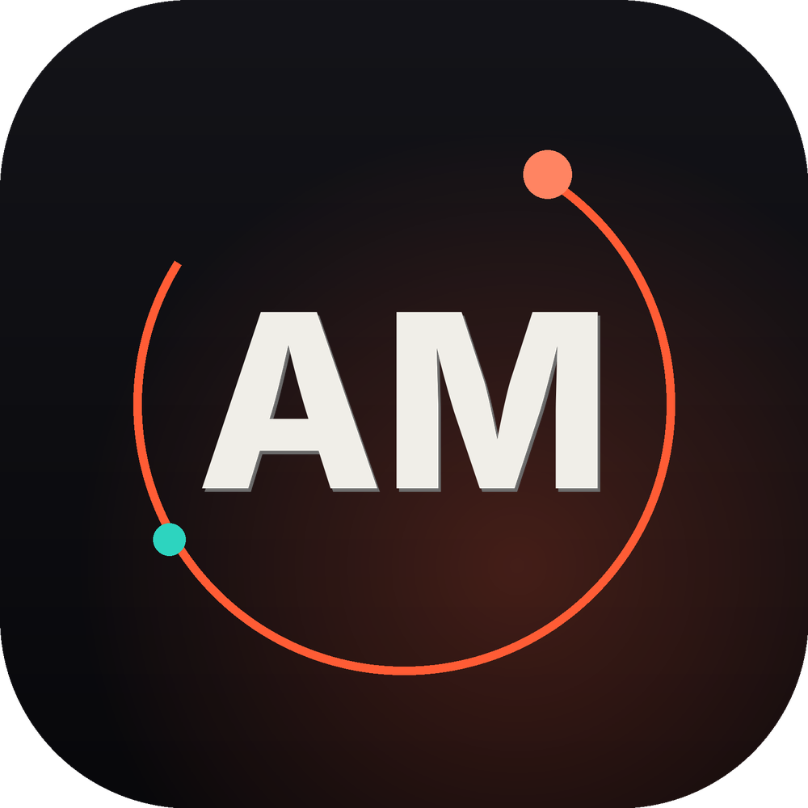

<div align="center">



# Muhammad Abdullah Malik

### AI & Backend Systems Engineer

**Production AI · scalable backends · privacy-first software — built in the open.**

[](https://abdullah-malik.vercel.app)
[](https://linkedin.com/in/abmalic01)
[](https://github.com/MalicKAbdullah)
[](mailto:mabdullahmalik119@gmail.com)
[](#)

</div>

---

## 👋 About

I design **production-grade AI systems** and **scalable backend infrastructure**, with a focus on healthcare automation and high-performance LLM workflows. Currently a Software Engineer at **DocNow EHR**, where I've shipped production AI workflows that cut manual overhead by ~60%.

Away from the day job, I'm an **open-source advocate** with a conviction that software should respect the people who use it — no dark patterns, no silent data collection. That belief became **Secure Suite**: six privacy-first apps that keep every byte on the user's device.

## 🧠 What I work with

```text
Generative AI & LLMs  ·  Python microservices for document intelligence & structured extraction
Backend Architecture  ·  FastAPI · Django · Node.js (NestJS) · distributed system design
Real-Time Systems     ·  WebSockets · SignalR · Socket.io
Computer Vision       ·  PyTorch · OpenCV · ResNet pipelines
Privacy Engineering   ·  AES-256-GCM · Argon2id · offline-first, on-device encryption
```

## 🔦 Featured — Secure Suite

> **Privacy is the product.** Six apps on one encrypted foundation. No servers, no accounts, no telemetry — data is encrypted on the device and never leaves it. All open source, MIT.

| App | What it is | Highlights |
| --- | --- | --- |
| 🔐 [**Vaultly**](https://github.com/MalicKAbdullah/vaultly) | Password manager | Biometric unlock · TOTP 2FA · Android Autofill · encrypted backups |
| 💊 [**DoseWise**](https://github.com/MalicKAbdullah/dosewise) | Medication tracker | Take/Skip from notifications · adherence analytics · family profiles |
| 📄 [**Ledgerly**](https://github.com/MalicKAbdullah/ledgerly) | Freelance invoicing | Pro PDF invoices · payments & expenses · recurring & estimates |
| 🧮 [**Tally**](https://github.com/MalicKAbdullah/tally) | Personal budget tracker | Cash + digital accounts · split/reimbursable expenses · budgets · recurring |
| 📓 [**Reflect**](https://github.com/MalicKAbdullah/reflect) | Encrypted journal | PIN/biometric lock · full-text search · encrypted photos |
| 🔒 [**OpenLock**](https://github.com/MalicKAbdullah/openlock) | App lock (Android) | Lock any app behind PIN/biometric · uninstall protection · focus schedules |
| 🛡️ [**secure-suite-core**](https://github.com/MalicKAbdullah/secure-suite-core) | Shared foundation | AES-256-GCM · Argon2id · design system · fully tested |

## 🛠️ Tech Stack


  


## 📊 On GitHub

<div align="center">

[](https://github.com/MalicKAbdullah)
[](https://github.com/MalicKAbdullah?tab=repositories)
[](https://abdullah-malik.vercel.app)

</div>

## 🤝 Let's connect

I'm open to work and collaboration in **AI, backend, and privacy-focused engineering**.

- 🌐 [Portfolio](https://abdullah-malik.vercel.app) · 💼 [LinkedIn](https://linkedin.com/in/abmalic01) · 📫 [mabdullahmalik119@gmail.com](mailto:mabdullahmalik119@gmail.com)

<div align="center"><sub>Built with care · privacy-first · open source</sub></div>
